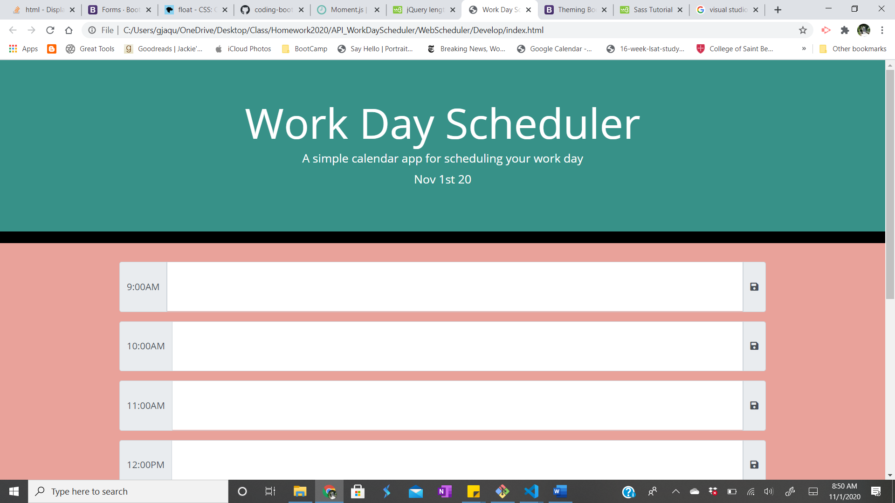
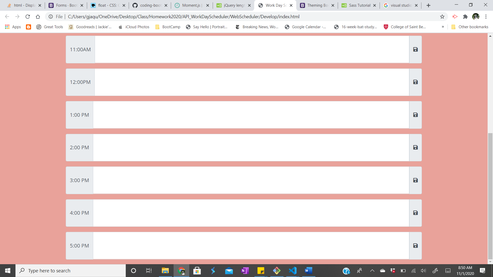

# WebScheduler
In I built a work day scheduler. Using HTML, CSS, jQuery, and Bootstrap. The scheduler is dynamic and uses the current date.

## Given Acceptence Criteria 
GIVEN I am using a daily planner to create a schedule- done
WHEN I open the planne
THEN the current day is displayed at the top of the calendar- done
WHEN I scroll down
THEN I am presented with time blocks for standard business hours- done
WHEN I view the time blocks for that day
THEN each time block is color-coded to indicate whether it is in the past, present, or future
WHEN I click into a time block
THEN I can enter an event
WHEN I click the save button for that time block
THEN the text for that event is saved in local storage
WHEN I refresh the page
THEN the saved events persist

## Description of HTML
On the UI there are 9 text boxes.The first one is labled 9:00AM and the last 5:00PM to represent the typical workday. The textboxes are input fields from bootstrap. A user is allowed to enter information. To the right of each input there is a save icon that was sourced from font awesome.

## Description of Javascript 

### Time 
The first thing on the UI that leverages javascript is the current time stamp. I used moment to pull in the current date. Next, are the colors of the input field. These are dynamic based off of the current date. If the current time matches the time of the scheduler the textbox will appear orange. If the time is in the past the textbox will appear grey, and if in the future whill appear white. 

### Local Stroage 
The final peice of this project is to use local storage. The purpose of the local storage is to save what the user has done to the UI without wiping the information clear until the next day. In the script...
## Live Link 

https://buildgal.github.io/WebScheduler/

## Screenshot 

